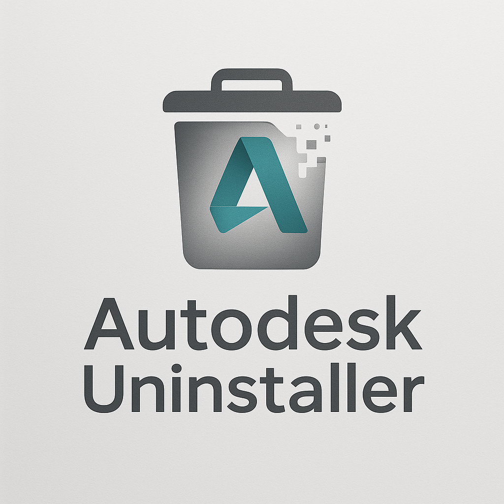

<div align="center">
  
  
  # Autodesk Uninstaller - Modular Edition
  
  [](https://docs.microsoft.com/en-us/powershell/)
  [](https://www.microsoft.com/en-us/windows)
  [](LICENSE)
  
  **A comprehensive PowerShell-based GUI application for uninstalling Autodesk products with selective cleanup capabilities.**
</div>

## Features

- **Modern GUI Interface**: Clean, intuitive interface for product selection
- **Selective Uninstallation**: Choose between complete removal or reinstall preparation
- **Add-in Preservation**: Optionally preserve add-ins and user settings for reinstallation
- **Comprehensive Logging**: Detailed logging of all operations
- **Modular Architecture**: Easy to maintain and extend
- **Administrator Privilege Handling**: Automatic elevation check and user notification

## Architecture

The application is structured into separate modules for maintainability:

### Core Modules

- **Config.psm1**: Configuration management and global variables
- **Logging.psm1**: Logging functionality with timestamped entries
- **ProductDetection.psm1**: Autodesk product detection and categorization
- **GUI.psm1**: User interface components and dialogs
- **ProgressWindow.psm1**: Progress indication during operations
- **UninstallOperations.psm1**: Uninstallation, backup, and cleanup operations

### Entry Points

- **Main.ps1**: Primary entry point for the application
- **AutodeskUninstaller.psm1**: PowerShell module entry point

## File Structure

```
AutodeskUninstaller/
├── Main.ps1                        # Main entry point
├── AutodeskUninstaller.psd1         # Module manifest
├── AutodeskUninstaller.psm1         # Module entry point
├── icon.png                         # Project icon
├── README.md                        # This file
└── Modules/
    ├── Config.psm1                  # Configuration and globals
    ├── Logging.psm1                 # Logging functionality
    ├── ProductDetection.psm1        # Product detection
    ├── GUI.psm1                     # User interface
    ├── ProgressWindow.psm1          # Progress display
    └── UninstallOperations.psm1     # Uninstall operations
```

## Usage

### Basic Usage

1. **Run as Administrator**: The application requires administrator privileges
2. **Execute Main.ps1**:
   ```powershell
   powershell.exe -ExecutionPolicy Bypass -File .\Main.ps1
   ```

### Uninstall Modes

#### Complete Removal
- Removes all Autodesk products and associated data
- Cleans up user settings, preferences, and add-ins
- Recommended for permanent removal

#### Reinstall Preparation
- Removes products but preserves add-ins and user settings
- Backs up add-ins to `C:\Temp\AutodeskAddInsBackup\`
- Useful when upgrading or reinstalling products

### Supported Products

- Autodesk Revit
- AutoCAD
- 3ds Max
- Maya
- Inventor
- Navisworks
- Civil 3D
- Fusion 360
- Desktop Connector
- Other Autodesk products...

## Logging

The application creates comprehensive logs in `C:\Temp\AutodeskUninstaller\`:

- **Action Log**: Timestamped record of all operations
- **Transcript Log**: Complete PowerShell session transcript
- **MSI Logs**: Individual MSI uninstaller logs (when applicable)

## Configuration

### Global Variables

All configuration is centralized in `Config.psm1`:

- Service names and process lists
- Registry hives for product detection
- Product-specific file paths
- Add-in locations and patterns

### Customization

To add support for new products:

1. Update `ProductPaths` in `Config.psm1`
2. Add product type detection in `ProductDetection.psm1`
3. Configure add-in paths in `AddInPaths` if needed

## Error Handling

- Comprehensive error handling with logging
- Graceful degradation for non-critical operations
- User-friendly error messages
- Automatic cleanup on failures

## Requirements

- **PowerShell 5.1 or later**
- **Administrator privileges**
- **Windows 10/11 or Windows Server 2016+**
- **.NET Framework 4.5 or later**

## Safety Features

- Confirmation dialogs before destructive operations
- Backup of important data in reinstall mode
- Detailed logging for troubleshooting
- Exit codes for automation scenarios

## Development

### Adding New Modules

1. Create new `.psm1` file in `Modules/` directory
2. Follow the existing module structure with proper documentation
3. Import required dependencies at the top
4. Export only public functions
5. Update `AutodeskUninstaller.psd1` to include the new module

### Code Standards

- Use approved PowerShell verbs
- Include comprehensive comment-based help
- Follow consistent error handling patterns
- Use proper module scoping for variables

## Troubleshooting

### Common Issues

1. **Access Denied**: Ensure running as administrator
2. **Module Loading Errors**: Check PowerShell execution policy
3. **GUI Not Displaying**: Verify .NET Framework installation
4. **Incomplete Uninstallation**: Check logs for specific errors

### Debug Mode

Enable verbose logging by modifying the `$ErrorActionPreference` in `Main.ps1`:

```powershell
$ErrorActionPreference = 'Continue'
```

## License

This project is provided as-is for educational and utility purposes. Use at your own risk.

## Support

For issues or questions:
1. Check the logs in `C:\Temp\AutodeskUninstaller\`
2. Review the README for troubleshooting steps
3. Examine the modular code for understanding the process

## Version History

- **1.0.0**: Initial modular release
  - Converted monolithic script to modular architecture
  - Improved maintainability and extensibility
  - Enhanced error handling and logging
